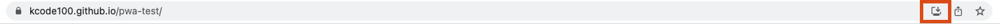

# Progressive Web Application

[Taught by Net Ninja on YouTube](https://www.youtube.com/playlist?list=PL4cUxeGkcC9gTxqJBcDmoi5Q2pzDusSL7)

## View as Mobile app

***[Open this page in your mobile browser](https://kcode100.github.io/pwa-test/)***

[https://kcode100.github.io/pwa-test/](https://kcode100.github.io/pwa-test/)

After a few seconds the "Add to home banner" will appear, and you can then use it like a native mobile app

- Home screen icon
- Works offline (by utilizing service worker caching)
- Works in separate window (not browser)

## View as Destop app

***[Open this page in your browser](https://kcode100.github.io/pwa-test/)***

Click install button to download app in URL bar (see image)

## Resources and Todo

- offline persistence with firebase

[See The Net Ninja tutorial on YouTube](https://www.youtube.com/watch?v=ciu62KLlwGQ&list=PL4cUxeGkcC9gTxqJBcDmoi5Q2pzDusSL7&index=26)

- Workbox strategies

[Workbox](https://developers.google.com/web/tools/workbox/modules/workbox-strategies#what_are_workbox_strategies)